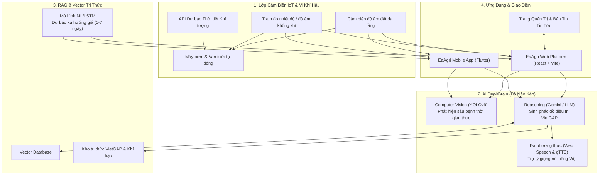

<div align="center">

  

  # 🌾 EaAgri — Hệ Sinh Thái Nông Nghiệp Thông Minh
  ### *Digital Farming System • AI "Dual-Brain" • IoT Smart Irrigation • Market Forecast*

  <p align="center">
    <strong>Giải pháp Nông nghiệp Số toàn diện ứng dụng Trí tuệ Nhân tạo (AI) và Internet of Things (IoT) dành cho nhà nông Việt Nam.</strong>
  </p>

  <p align="center">
    <a href="https://www.eaagri.vn/"></a>
    <a href="https://github.com/TuansHuynh/EaAgri"></a>
    <a href="https://play.google.com/store/apps/details?id=com.eaagri.app"></a>
  </p>

  <p align="center">
    
    
    
    
    
    
    
  </p>

</div>

---

## 🏆 Thành Tựu & Giải Thưởng (Awards & Honors)

* 🥇 **Quán quân Bảng 1C** (*Công nghệ Nông nghiệp & Công nghệ Thực phẩm*) — **NTTU Innovation Startup Challenge 2026**.
* 🌟 Dự án xuất sắc đại diện cho chuyển đổi nông nghiệp số vùng Tây Nguyên và khẳng định tiềm năng thương mại hóa thực địa cao.

---

## 📖 Giới Thiệu Dự Án (Overview)

Ngành nông nghiệp sầu riêng và cây ăn trái giá trị cao tại Việt Nam đang đối mặt với **"Tứ giác rủi ro"**:
1. **Bất đối xứng thông tin thị trường:** Nông dân bị ép giá do thiếu dữ liệu dự báo biến động giá nông sản.
2. **Sâu bệnh hại phức tạp:** Nấm *Phytophthora*, rệp sáp, xì mủ, rụng trái non không được phát hiện sớm.
3. **Thất thoát tài nguyên tưới tiêu:** Tưới theo cảm tính dẫn đến lãng phí nước và nguy cơ úng rễ.
4. **Thiếu truy xuất nguồn gốc:** Khó khăn khi tiếp cận các tiêu chuẩn xuất khẩu chính ngạch (VietGAP, GlobalGAP).

**EaAgri** ra đời với sứ mệnh mang đến giải pháp **Nông Nghiệp Thông Minh Hybrid**, kết hợp cảm biến IoT thời gian thực, thị giác máy tính AI và mô hình ngôn ngữ lớn (LLM) để đồng hành cùng nhà nông từ khâu chăm sóc, phòng ngừa sâu bệnh đến thu hoạch và tiêu thụ.

---

## 🏗️ Kiến Trúc Hệ Thống (Hybrid System Architecture)



---

## ⚡ Các Tính Năng Nổi Bật (Core Features)

### 1. 🤖 AI Dual-Brain & Chẩn Đoán Bệnh Sầu Riêng
* **Thị giác máy tính (Computer Vision):** Quét nhận diện tự động lá, quả sầu riêng, khoanh vùng nấm bệnh (*Phytophthora*, rệp sáp, vàng lá rụng hoa).
* **Suy luận nông nghiệp sâu (Reasoning):** Tích hợp mô hình Gemini phân tích nguyên nhân gốc rễ và đề xuất phác đồ điều trị chuẩn VietGAP.
* **Trợ lý giọng nói:** Hỗ trợ nhận diện giọng nói (Speech-to-Text) và phát âm thanh tiếng Việt hướng dẫn trực quan cho bà con.

### 2. 💧 Hệ Thống Tưới Thông Minh 3 Lớp (Smart Irrigation)
* **Lớp 1 - Sinh học:** Tính toán nhu cầu nước theo chu kỳ sinh trưởng và tuổi cây.
* **Lớp 2 - Môi trường (Pre-emptive Stop):** Tích hợp dữ liệu thời tiết tự động dừng tưới nếu có dự báo mưa > 10mm.
* **Lớp 3 - Bảo vệ:** Cưỡng chế ngắt bơm khi độ ẩm đất vượt 70% nhằm chống úng rễ.

### 3. 📈 Module Dự Báo Giá & Xu Hướng Thị Trường (LSTM ML)
* Khai phá dữ liệu chuỗi thời gian (Time-series) giá sầu riêng lịch sử.
* Cung cấp dự báo biến động giá ngắn hạn (1–7 ngày) giúp nông dân ra quyết định thu hoạch thông minh, tránh bán đáy.

### 4. 📰 Cổng Thông Tin & Quản Trị Tri Thức (News & Knowledge Portal)
* Quản lý bài viết kỹ thuật canh tác, cảnh báo mùa vụ và giá cả thị trường.
* Hệ thống phân quyền chặt chẽ (Super Admin, Editor, User) với Supabase Row-Level Security.

---

## 🛠️ Công Nghệ Sử Dụng (Tech Stack)

| Lớp (Layer) | Công nghệ | Mục đích |
| :--- | :--- | :--- |
| **Frontend Web** | React 19, TypeScript, Vite 7 | Giao diện Single Page Application tốc độ cao |
| **Styling & 3D** | SCSS Modular (BEM), Three.js, AOS, RemixIcon | Trải nghiệm người dùng cao cấp, mô hình cây 3D |
| **Backend & Cloud** | Supabase (PostgreSQL, RLS, Storage, Auth) | Quản lý tài khoản, dữ liệu nhật ký, lưu trữ ảnh |
| **AI / ML & NLP** | Google Gemini API, YOLOv9, Web Speech API, gTTS | Bộ não trợ lý AI, thị giác máy tính và giọng nói |
| **Mobile App** | Flutter Cross-platform (Android / iOS) | Ứng dụng di động thực địa cho nhà nông |
| **DevOps & Deploy** | Vercel, Git / GitHub | CI/CD và triển khai toàn cầu tốc độ cao |

---

## 📁 Cấu Trúc Thư Mục (Project Structure)

```text
EaAgri/
├── public/                      # Static assets & SEO files
│   ├── assets/                  # Hình ảnh dự án, minh họa
│   ├── logo_v1.jpg              # Logo chính thức của EaAgri
│   ├── manifest.json            # Web App Manifest
│   ├── robots.txt               # Chỉ dẫn thu thập dữ liệu Googlebot
│   └── sitemap.xml              # Sơ đồ trang web kèm Image SEO
├── src/
│   ├── api/                     # API client gọi Chatbot AI Gateway
│   ├── components/              # Các UI Components chuyên biệt
│   │   ├── AIChat.tsx           # Trợ lý AI nông nghiệp tương tác giọng nói
│   │   ├── AwardsSection.tsx    # Vinh danh giải thưởng Quán quân NTTU
│   │   ├── DurianScannerSection.tsx # Trình mô phỏng quét chẩn đoán sầu riêng
│   │   ├── ParticleTree3D.tsx   # Cây 3D Three.js tương tác
│   │   ├── ProblemSolutionSection.tsx # Lời giải cho tứ giác rủi ro
│   │   ├── TeamSection.tsx      # Đội ngũ vận hành cốt lõi
│   │   └── ...
│   ├── context/                 # AuthContext quản lý trạng thái đăng nhập
│   ├── pages/                   # Các trang chính
│   │   ├── HomePage.tsx         # Trang chủ
│   │   ├── ArchitecturePage.tsx # Trang kiến trúc hệ thống IoT & AI
│   │   ├── NewsList.tsx         # Trang danh sách tin tức
│   │   ├── NewsDetail.tsx       # Trang chi tiết bài viết
│   │   ├── UploadNews.tsx       # Đăng bài viết mới
│   │   ├── ManageNews.tsx       # Quản lý bài viết (Admin)
│   │   └── PrivacyPolicy.tsx    # Chính sách bảo mật dữ liệu
│   ├── routers/                 # Cấu hình định tuyến React Router
│   ├── styles/                  # Hệ thống SCSS tổ chức theo BEM & Modular
│   └── utils/                   # Supabase client và helpers
├── index.html                   # HTML template tối ưu SEO & Schema.org
├── package.json                 # Cấu hình Dependencies & Scripts
├── tsconfig.json                # Cấu hình TypeScript
├── vercel.json                  # Cấu hình routing & SPA rewrite Vercel
└── vite.config.ts               # Cấu hình Vite Build Tool
```

---

## 🚀 Hướng Dẫn Cài Đặt & Chạy Cục Bộ (Getting Started)

### Yêu cầu tiên quyết:
* **Node.js** >= 18.x
* **npm** hoặc **yarn** / **pnpm**

### 1. Clone repository
```bash
git clone https://github.com/TuansHuynh/EaAgri.git
cd EaAgri
```

### 2. Cài đặt các thư viện phụ thuộc
```bash
npm install
```

### 3. Cấu hình biến môi trường (`.env.local`)
Tạo tệp `.env.local` ở thư mục gốc:
```env
VITE_SUPABASE_URL=your_supabase_project_url
VITE_SUPABASE_ANON_KEY=your_supabase_anon_key
VITE_API_CHATBOT_URL=your_ai_backend_gateway_url
```

### 4. Chạy Development Server
```bash
npm run dev
```
Truy cập ứng dụng tại: `http://localhost:5173/`

### 5. Build Production
```bash
npm run build
```

---

## 👥 Đội Ngũ Sáng Lập & Vận Hành (Core Team)

Dự án được sáng lập và phát triển bởi sinh viên **Khoa Công nghệ Thông tin — Trường Đại học Nguyễn Tất Thành**:

| Thành viên | Vai trò | Trách nhiệm chính |
| :--- | :--- | :--- |
| **PHAN ĐĂNG HUY** | Founder & CEO | Chiến lược sản phẩm • Điều phối dự án • Gọi vốn |
| **NGUYỄN ANH GIẢNG** | CTO / AI & Data Lead | Kiến trúc AI & Dữ liệu • Phát triển thuật toán & Giải pháp |
| **ĐẶNG VĂN CHUNG** | Field Operations Lead | Khảo sát thực địa • Hỗ trợ kỹ thuật • Triển khai Pilot vườn |
| **HUỲNH ANH TUẤN** | Growth & Operations Lead | Truyền thông • Onboarding người dùng • Vận hành sản phẩm |

---

## 🗺️ Lộ Trình Phát Triển (Roadmap)

- [x] **Giai đoạn 1:** Nghiên cứu thực địa vườn sầu riêng tại Đắk Lắk & xây dựng mô hình AI Dual-Brain.
- [x] **Giai đoạn 2:** Đạt Quán quân cuộc thi khởi nghiệp đổi mới sáng tạo NTTU 2026.
- [x] **Giai đoạn 3:** Ra mắt nền tảng Web & Mobile App kết nối trạm IoT tưới thông minh 3 lớp.
- [ ] **Giai đoạn 4:** Mở rộng thử nghiệm Pilot diện rộng trên 50+ hợp tác xã và hộ nông dân Tây Nguyên.
- [ ] **Giai đoạn 5:** Hoàn thiện sàn truy xuất nguồn gốc QR và kết nối chuỗi cung ứng xuất khẩu chính ngạch.

---

## 📞 Liên Hệ & Hỗ Trợ (Contact & Community)

* 🌐 **Website chính thức:** [https://www.eaagri.vn/](https://www.eaagri.vn/)
* 📧 **Email:** [eaagri@eaagri.id.vn](mailto:eaagri@eaagri.id.vn)
* 🐙 **GitHub:** [TuansHuynh/EaAgri](https://github.com/TuansHuynh/EaAgri)
* 📱 **Google Play:** [EaAgri App](https://play.google.com/store/apps/details?id=com.eaagri.app)

---

<div align="center">
  <p>© 2026 <strong>EaAgri Team</strong>. Nông Nghiệp Số Vì Nông Dân Việt.</p>
</div>
